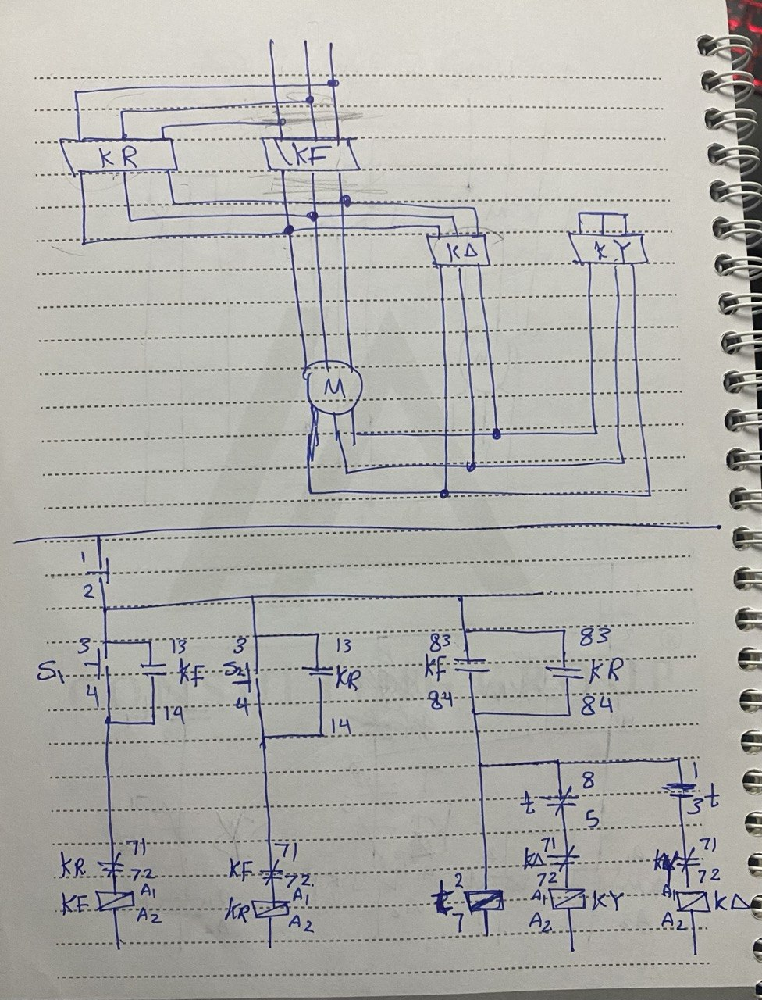

# Forward-Reverse-Star-Delta-Motor-Starter-Classic-Control

##  Project Overview

This project implements a **Classic Control (Relay Logic)** system for a **3-phase induction motor** that supports:

* Forward and Reverse rotation
* Reduced starting current using Star-Delta technique

The system combines **direction control** with **Star-Delta starting** for safe and efficient motor operation.

---

##  Project Type

 Classic Control (Hardwired Relay Logic)
 No PLC used (No TIA Portal programming)

---

##  Objective

To design a system that:

* Controls motor direction (Forward / Reverse)
* Reduces starting current using Star-Delta method
* Ensures safe operation using interlocking

---

##  Components Used

* Forward Contactor (KF)
* Reverse Contactor (KR)
* Star Contactor (KY)
* Delta Contactor (KΔ)
* Timer Relay (t - ON delay)
* Start Buttons (Forward / Reverse)
* Stop Button (NC)
* 3-Phase Motor

---

##  Working Principle

###  Forward Operation

1. Press Forward Start → KF is energized
2. Motor starts in **Star mode (KY ON)**
3. Timer starts
4. After delay → switches to **Delta (KΔ ON)**

---

###  Reverse Operation

1. Press Reverse Start → KR is energized
2. Motor rotates in reverse direction
3. Starts in Star mode
4. After delay → switches to Delta

---

###  Stop Function

* Press Stop → all contactors are de-energized immediately

---

##  Interlocking Protection

### 1. Direction Interlocking

* KF and KR cannot be ON at the same time
* Prevents phase short circuit

### 2. Star/Delta Interlocking

* KY and KΔ are interlocked
* Prevents short circuit during transition

---

##  Important Notes

* Incorrect wiring may cause **severe short circuit**
* Timer must ensure proper switching delay
* Suitable only for motors designed for Star-Delta starting

---

##  Key Concepts

* Classic Control
* Forward / Reverse motor control
* Star-Delta starting
* Electrical interlocking
* Industrial motor protection

---

##  Circuit Diagram

---

##  Demo Video

---

##  How to Operate

1. Power ON system
2. Choose direction:

   * Forward → normal rotation
   * Reverse → opposite rotation
3. Motor starts in Star
4. Automatically switches to Delta
5. Press Stop anytime to shutdown
